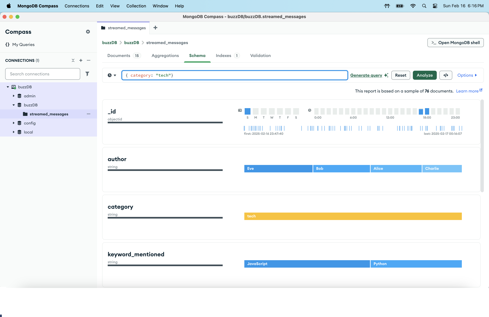

# buzzline-05-stonerogers
Streaming Data, Project 5
Melissa Stone Rogers, [GitHub](https://github.com/meldstonerogers/buzzline-05-stonerogers)

## Introduction

This is a professional project incorporating a relational data store. This project uses Apache Kafka to create uniquie JSON producers and consumers to simulate streaming data. Python Version 3.11.6 was used, as well as Git for version control. 
This project was forked from Dr. Case's project repository found [here](https://github.com/denisecase/buzzline-05-case). Much of the detailed instructions in this README.md were borrowed from Dr. Case's project specifications, and updated for my machine.
The sample project uses SQLite and was modified to use MongoDB.
Commands were used on a Mac machine running zsh. 

## Task 1. Use Tools from Module 1 and 2

Before starting, ensure you have first completed the setup tasks in [Project 1](https://github.com/denisecase/buzzline-01-case) and [Project 2](https://github.com/denisecase/buzzline-02-case), created by Dr. Case. 
Python 3.11 is required. 

## Task 2. Copy This Example Project and Rename

Once the tools are installed, copy/fork this project into your GitHub account and create your own version of this project to run and experiment with.
Name it `buzzline-04-yourname` where yourname is something unique to you.
Follow the instructions in [FORK-THIS-REPO.md](https://github.com/denisecase/buzzline-01-case/docs/FORK-THIS-REPO.md).

## Task 3. Manage Local Project Virtual Environment

Follow the instructions in [MANAGE-VENV.md](https://github.com/denisecase/buzzline-01-case/docs/MANAGE-VENV.md) to:
1. Create your .venv
2. Activate .venv
3. Install the required dependencies using requirements.txt.

```zsh
python3.11 -m venv .venv
source .venv/bin/activate
```
```zsh
python -m pip install --upgrade pip setuptools wheel
python -m pip install --upgrade -r requirements.txt

```

Remember, each time a new terminal is opened, activate the .venv. 
```zsh
source .venv/bin/activate
```

### Initial Project Commit 
Turn on the autosave function in VS Code. Push changes to GitHub freqently to effectively track changes. Update the commit message to a meaningful note for your changes. 
```zsh
git add .
git commit -m "initial"                         
git push origin main
```

## Task 4. Start Zookeeper and Kafka (2 Terminals)

If Zookeeper and Kafka are not already running, you'll need to restart them.
See instructions at [SETUP-KAFKA.md] to:

1. Start Zookeeper Service ([link](https://github.com/denisecase/buzzline-02-case/blob/main/docs/SETUP-KAFKA.md#step-7-start-zookeeper-service-terminal-1))
### Start Zookeeper Service (Terminal 1)

```zsh
cd ~/kafka
chmod +x zookeeper-server-start.sh
bin/zookeeper-server-start.sh config/zookeeper.properties
```

Keep this terminal open while working with Kafka.

2. Start Kafka ([link](https://github.com/denisecase/buzzline-02-case/blob/main/docs/SETUP-KAFKA.md#step-8-start-kafka-terminal-2))

### Start Kafka (Terminal 2)
```zsh
cd ~/kafka
chmod +x kafka-server-start.sh
bin/kafka-server-start.sh config/server.properties
```
Keep this terminal open while working with Kafka. 

---

## Task 5. Start a New Streaming Application

This will take two more terminals:

1. One to run the producer which writes messages. 
2. Another to run the consumer which reads messages, processes them, and writes them to a data store. 

### Producer (Terminal 3) 

Start the producer to generate the messages. 
The existing producer writes messages to a live data file in the data folder.
If Zookeeper and Kafka services are running, it will try to write them to a Kafka topic as well.
For configuration details, see the .env file. 

In VS Code, open a NEW terminal.
Use the commands below to activate .venv, and start the producer. 

```zsh
source .venv/bin/activate
python3 -m producers.producer_case
```

The producer will still work if Kafka is not available.

### Consumer (Terminal 4) - Two Options

Start an associated consumer. 
You have two options. 
1. Start the consumer that reads from the live data file.
2. OR Start the consumer that reads from the Kafka topic.

In VS Code, open a NEW terminal in your root project folder. 
Use the commands below to activate .venv, and start the consumer. 

```zsh
source .venv/bin/activate
python3 -m consumers.kafka_consumer_case
OR
python3 -m consumers.file_consumer_case
```

---
## Task 6. Modification to Use MongoDB
A new file, consumer_stonerogers.py, was created to store consumed date to a MongoDB database. File content from kafka_consumer_case.py was modified to process consumed messages into a MongoDB data base, buzzDB. The two files can be reviewed for differences. A main change was including PyMongo distribution, which contains tools for interaction with MongoDB databases from Python. MongoClient was used wiht a URI for database connection. buzzDB is the database store now, instead of using sqlite. Once these updates were made, to properly run the code, PyMongo had to be installed into the virtual environment using the command: 

```zsh
pip install pymongo
```

Additionally, I needed to install the MongoDB Tap to Homebrew, which I did using the following code: 

```zsh
brew tap mongodb/brew
```
```zsh
brew install mongodb-community@7.0
```

I then started MongoDB with the following code: 

```zsh
brew services start mongodb-community@7.0
```

I could then connect to the MongoDB shell using: 

```zsh
mongosh
```

Last here, I had to add the MongoDB URI retrieval logic to the utils.tuils_config module: 

```zsh

def get_mongo_uri() -> str:
    """
    Get MongoDB URI from environment variable.
    Returns:
        str: MongoDB URI.
    """
    mongo_uri = os.getenv("MONGO_URI", "mongodb://localhost:27017")  # Default to localhost if not set
    if not mongo_uri:
        raise ValueError("MONGO_URI environment variable not set.")
    return mongo_uri
```

Now would be a great time to commit changes to GitHub!

Once these steps are completed, follow the steps below to start the producer, and then you are ready to run your newly modified consumer file. 

This will take two more terminals:

1. One to run the producer which writes messages. 
2. Another to run the consumer which reads messages, processes them, and writes them to a database using MongoDB. 

### Producer (Terminal 5) 

Start the producer to generate the messages. 
The existing producer writes messages to a live data file in the data folder.
If Zookeeper and Kafka services are running, it will try to write them to a Kafka topic as well.
For configuration details, see the .env file. 

In VS Code, open a NEW terminal.
Use the commands below to activate .venv, and start the producer. 

```zsh
source .venv/bin/activate
python3 -m producers.producer_case
```

### Consumer (Terminal 6) 

Start the newly modified consumer.

In VS Code, open a NEW terminal in your root project folder. 
Use the commands below to activate .venv, and start the consumer. 

```zsh
source .venv/bin/activate
python3 -m consumers.consumer_stonerogers
```

Download the [MongoDB Compass](https://www.mongodb.com/products/tools/compass) application to query and analyze data stored in the new buzzDB database. 
From MondgoDB Compass, you have a range of options to query and analyze your data. By connecting to this data store, I did not have to alter the consumer file to specify data to be stored. Instead, I now have all data being produced and I can query as I wish. For the purpose of this project, I wanted to be curious about what keywords were found within each category, which could also lend some consideration to the average sentiment of each category. 

Using the Schema tab, I was able to review different key words within each category, as seen below. 




---

### Final Project Commit 
Insure all final changes are committed to GitHub.
```zsh
git add .
git commit -m "final"                         
git push origin main
```
---
## Review the Project Code for Further Learning

Review the requirements.txt file. 
- What - if any - new requirements do we need for this project?
- Note that requirements.txt now lists both kafka-python and six. 
- What are some common dependencies as we incorporate data stores into our streaming pipelines?

Review the .env file with the environment variables.
- Why is it helpful to put some settings in a text file?
- As we add database access and passwords, we start to keep two versions: 
   - .evn 
   - .env.example
 - Read the notes in those files - which one is typically NOT added to source control?
 - How do we ignore a file so it doesn't get published in GitHub (hint: .gitignore)

Review the .gitignore file.
- What new entry has been added?

Review the code for the producer and the two consumers.
 - Understand how the information is generated by the producer.
 - Understand how the different consumers read, process, and store information in a data store?

Compare the consumer that reads from a live data file and the consumer that reads from a Kafka topic.
- Which functions are the same for both?
- Which parts are different?

What files are in the utils folder? 
- Why bother breaking functions out into utility modules?
- Would similar streaming projects be likely to take advantage of any of these files?

What files are in the producers folder?
- How do these compare to earlier projects?
- What has been changed?
- What has stayed the same?

What files are in the consumers folder?
- This is where the processing and storage takes place.
- Why did we make a separate file for reading from the live data file vs reading from the Kafka file?
- What functions are in each? 
- Are any of the functions duplicated? 
- Can you refactor the project so we could write a duplicated function just once and reuse it? 
- What functions are in the sqlite script?
- What functions might be needed to initialize a different kind of data store?
- What functions might be needed to insert a message into a different kind of data store?

---

## Explorations

- Did you run the kafka consumer or the live file consumer? Why?
- Can you use the examples to add a database to your own streaming applications? 
- What parts are most interesting to you?
- What parts are most challenging? 

---

## Later Work Sessions
When resuming work on this project:
1. Open the folder in VS Code. 
2. Open a terminal and start the Zookeeper service. If Windows, remember to start wsl. 
3. Open a terminal and start the Kafka service. If Windows, remember to start wsl. 
4. Open a terminal to start the producer. Remember to activate your local project virtual environment (.env).
5. Open a terminal to start the consumer. Remember to activate your local project virtual environment (.env).

## Save Space
To save disk space, you can delete the .venv folder when not actively working on this project.
You can always recreate it, activate it, and reinstall the necessary packages later. 
Managing Python virtual environments is a valuable skill. 

## License
This project is licensed under the MIT License as an example project. 
You are encouraged to fork, copy, explore, and modify the code as you like. 
See the [LICENSE](LICENSE.txt) file for more.
